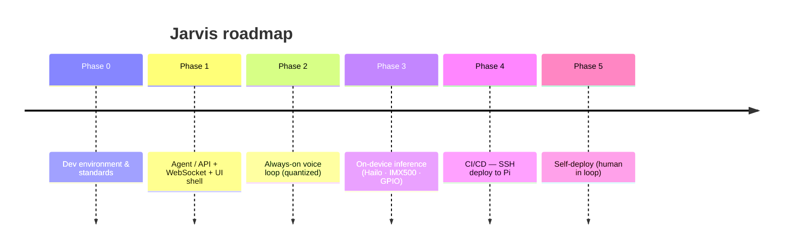

# Jarvis

A handheld, physically embodied AI companion — day planning, notes, calendar, and a
sparring partner for hobby projects. Runs on a Raspberry Pi 5 (Hailo NPU + IMX500).

## Roadmap



## Project structure

Four layers: **hardware** (probed) → **backends** (model serving) → **capabilities**
(user-facing abilities, each with a local or remote provider) → **tools** (MCP).

```
.devcontainer/            dev environment (Python/Node/Rust/Tauri)
.github/                  CI workflows, issue templates
.claude/                  skills, rules, agent config
agent/                    Python — Jarvis core, the deployable agent
  src/jarvis_agent/
    core/                 loop, state machine, router
    hardware/             device probes + drivers (Pi-only)
    backends/             model-serving clients (local | faelab)
    capabilities/         manifests + providers (local | faelab)
    tools/                MCP client + built-in tools
    discovery/            catalogs, mDNS, trust allowlist
    events/               MQTT client, event envelope, notification policy
    store/                local persistent state
frontend/                 Tauri app — TS/React UI + src-tauri/ (Rust)
packages/                 shared TS — protocol (WS + events), ui, config
models/                   manifest.yaml (tracked); models/store/ (weights) is git-ignored
profiles/                 home.yaml, work.yaml, dev.yaml
deploy/                   compose, systemd units, deploy supervisor
docs/                     architecture, state machine, deployment
scripts/                  ci-local.sh, version.sh
```

Jarvis core runs anywhere (Pi, VPS, laptop); what it can do is resolved at startup from
config + probing. Ecosystem tools are discovered over **MCP**; pushed events arrive over
**MQTT**, with Jarvis always connecting outbound.

> [!NOTE]
> Today `agent/`, `frontend/`, `docs/`, `scripts/`, `.devcontainer/`, `.github/` and
> `.claude/` exist — the rest lands with the epics on the [board](https://github.com/users/faering/projects/3).

## Run the app

```sh
corepack enable && pnpm install
pnpm turbo run lint test build
cd frontend && cargo tauri dev      # native window; Vite dev server on :5173
```

## Run the model stack

`docker compose up -d` starts the agent plus local model servers: Ollama (LLM, `qwen2.5:1.5b`)
and speaches (Whisper STT + Piper TTS), reachable on `jarvis-net` only. The first run pulls
the images (~12 GB unpacked) and ~1.2 GB of models, so allow several minutes. CPU by default; for an
NVIDIA GPU, uncomment the `deploy:` snippet in `docker-compose.yml`. Check it end to end
with `cd agent && uv run --frozen --extra test pytest -m models`.

## Docs
- [Architecture](docs/architecture.md)
- [Agent state machine](docs/state-machine.md)
- [Deployment](docs/deploy.md)
- [GitHub MCP PAT setup](docs/github-mcp-pat.md)
