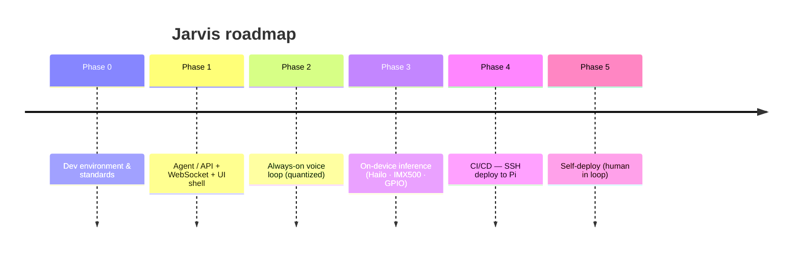

# Jarvis

A handheld, physically embodied AI companion — day planning, notes, calendar, and a
sparring partner for hobby projects. Runs on a Raspberry Pi 5 (Hailo NPU + IMX500).

## Roadmap

## Docs
- [Architecture](docs/architecture.md)
- [Agent state machine](docs/state-machine.md)
- [Deployment](docs/deploy.md)
- [GitHub MCP PAT setup](docs/github-mcp-pat.md)
