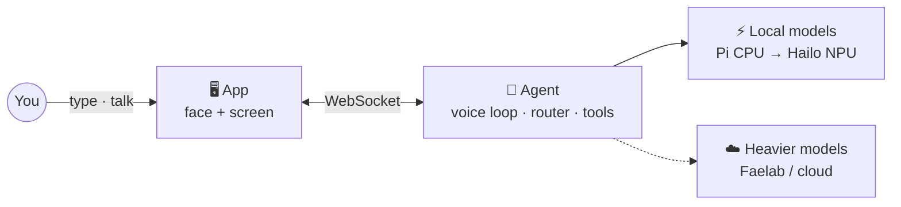
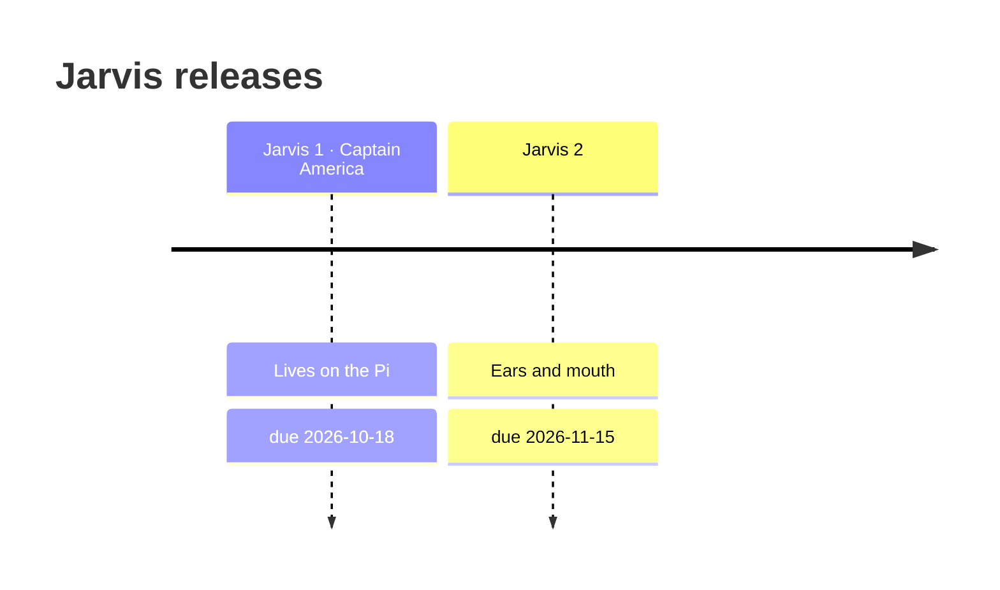

# Jarvis

[](https://github.com/faering/jarvis/actions/workflows/ci.yml)
[](https://github.com/faering/jarvis/releases?q=jarvis-v&expanded=true)
[](https://github.com/faering/jarvis/releases?q=agent-v&expanded=true)
[](https://github.com/faering/jarvis/releases?q=app-v&expanded=true)

A handheld AI companion on a Raspberry Pi 5: it plans your day, takes notes, keeps your
calendar, and spars with you on your hobby projects. Local models first, its own face on
its own screen.

**[Architecture](docs/architecture.md)** · **[Set up a Pi](docs/pi-setup.md)** ·
**[Deploy](docs/deploy.md)** · **[Develop](docs/development.md)** ·
**[Models](docs/models.md)** · **[Logging](docs/logging.md)** ·
**[Decisions](docs/adr/README.md)** · **[Contributing](AGENTS.md)** ·
**[Board](https://github.com/users/faering/projects/3)**

## What it is


```mermaid
flowchart LR
  you((You)) -- "type · talk" --> app["🖥️ App<br/>face + screen"]
  app <-- WebSocket --> agent["🧠 Agent<br/>voice loop · router · tools"]
  agent --> local["⚡ Local models<br/>Pi CPU → Hailo NPU"]
  agent -.-> heavy["☁️ Heavier models<br/>Faelab / cloud"]
```

- **An app** (Tauri) shows Jarvis's face and conversation on the Pi's screen.
- **An agent** (Python, in Docker) runs the conversation and picks a model per task: small
  local models for quick replies, bigger ones in the background.
- **One assistant, several devices:** a handheld Pi today; a wall display or a mini PC later.
- **Shipped by CI** to the Pi over Tailscale, verified before it installs.

More in [Architecture](docs/architecture.md).

## Where it's at

**Today:** Jarvis runs on the Pi, answers typed questions with a local model
(`qwen2.5-1.5b`), and shows its reply on its face.
**Next:** it listens and speaks, and moves its thinking to the AI accelerator.

<!-- roadmap:start -->
<!-- Generated by scripts/release/jarvis-release readme from the milestones and
     releases/*.toml: edit those, not this block. -->

```mermaid
timeline
  title Jarvis releases
  Jarvis 1 · Captain America : Lives on the Pi : due 2026-10-18
  Jarvis 2 : Ears and mouth : due 2026-11-15
```

[Milestones](https://github.com/faering/jarvis/milestones?state=all) · [Jarvis releases](https://github.com/faering/jarvis/releases?q=jarvis-v&expanded=true)
<!-- roadmap:end -->

## Get started

| I want to… | Go to |
|---|---|
| Run Jarvis on my machine | [Develop](docs/development.md): devcontainer, `docker compose up -d`, the app |
| Put Jarvis on a Raspberry Pi | [Set up a Pi](docs/pi-setup.md), then [Deploy](docs/deploy.md) |
| Try or change its models | [Models](docs/models.md): the catalogue and the playground |
| Read its logs | [Logging](docs/logging.md): `jarvis-logs -f` |
| Work on the code | [Contributing](AGENTS.md) and the [Board](https://github.com/users/faering/projects/3) |

## Repository

```
agent/       the agent (Python)             frontend/   the app (TypeScript/React + Rust)
packages/    shared TypeScript (protocol)   deploy/     the Pi's compose stack
scripts/     setup, deploy, release tools   docs/       everything else
```

Folder by folder: [Architecture → Code layout](docs/architecture.md#code-layout).
