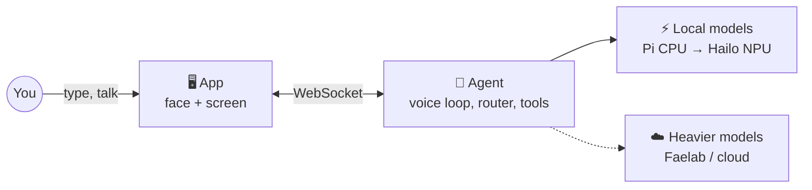
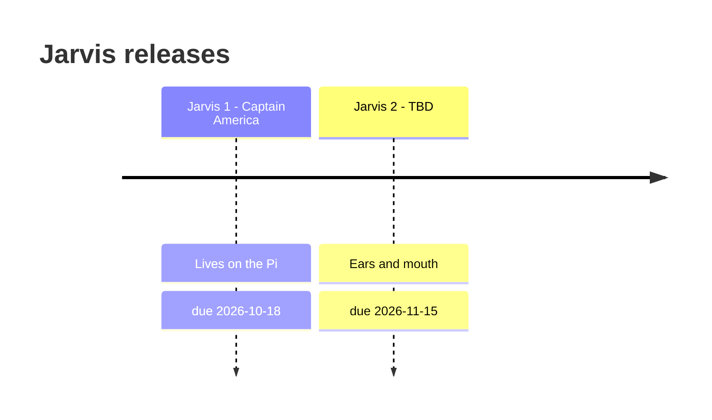

[](https://github.com/faering/jarvis/actions/workflows/ci.yml)
[](https://github.com/faering/jarvis/releases?q=jarvis-v&expanded=true)
[](https://github.com/faering/jarvis/releases?q=agent-v&expanded=true)
[](https://github.com/faering/jarvis/releases?q=app-v&expanded=true)

# Jarvis

A handheld AI companion on a Raspberry Pi 5: it plans your day, takes notes, keeps your
calendar, and spars with you on your hobby projects. Local models first, its own face on
its own screen.

| I want to… | Read |
|---|---|
| Understand how Jarvis works | [Architecture](docs/architecture.md) |
| Run Jarvis on my machine | [Develop](docs/development.md) |
| Put Jarvis on a Raspberry Pi | [Set up a Pi](docs/pi-setup.md), then [Deploy](docs/deploy.md) |
| Try or change its models | [Models](docs/models.md) |
| Read its logs | [Logging](docs/logging.md) |
| Know why it's built this way | [Decisions](docs/adr/README.md) |

## What it is


```mermaid
flowchart LR
  you((You)) -- "type, talk" --> app["🖥️ App<br/>face + screen"]
  app <-- WebSocket --> agent["🧠 Agent<br/>voice loop, router, tools"]
  agent --> local["⚡ Local models<br/>Pi CPU → Hailo NPU"]
  agent -.-> heavy["☁️ Heavier models<br/>Faelab / cloud"]
```

- **An app** (Tauri) shows Jarvis's face and conversation on the Pi's screen.
- **An agent** (Python, in Docker) runs the conversation and picks a model per task: small
  local models for quick replies, bigger ones in the background.
- **One assistant, several devices:** a handheld Pi today; a wall display or a mini PC later.
- **Shipped by CI** to the Pi over Tailscale, verified before it installs.

More in [Architecture](docs/architecture.md).

## Where it's at

**Today:** Jarvis runs on the Pi, answers typed questions with a local model
(`qwen2.5-1.5b`), and shows its reply on its face.
**Next:** it listens and speaks, and moves its thinking to the AI accelerator.

<!-- roadmap:start -->
<!-- Generated by scripts/release/jarvis-release readme from the milestones and
     releases/*.toml: edit those, not this block. -->

```mermaid
timeline
  title Jarvis releases
  Jarvis 1 - Captain America : Lives on the Pi : due 2026-10-18
  Jarvis 2 - TBD : Ears and mouth : due 2026-11-15
```

See the [milestones](https://github.com/faering/jarvis/milestones?state=all) and the [Jarvis releases](https://github.com/faering/jarvis/releases?q=jarvis-v&expanded=true).
<!-- roadmap:end -->

## Repository

In the order GitHub lists it above:

```
.claude/          # how the AI agents that help build Jarvis work: skills and rules
.devcontainer/    # the development environment, everything in one container
.github/          # CI and releases: tests every PR, builds releases, deploys to the Pi
agent/            # Jarvis's brain: holds the conversation, picks a model per task (Python)
deploy/           # what runs on a device: the Pi's stack (agent + local model server)
docs/             # how it works and how to set it up; decisions in docs/adr
frontend/         # Jarvis's face: the app on its screen (React UI in a small Rust shell)
packages/         # shared TypeScript, like the agent-app message format
scripts/          # tools for devices and releases: Pi setup, deploy, logs, releases
```
