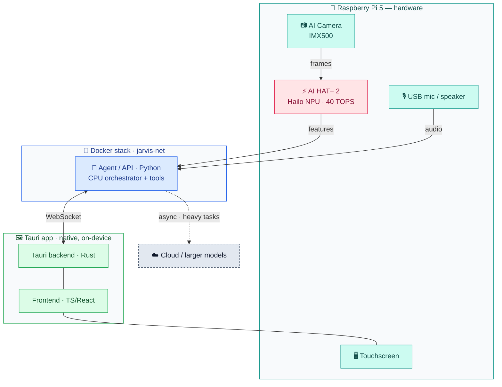

# Architecture

Work routes across three compute layers; the Dockerized agent and the native Tauri display
talk over one WebSocket.

## Compute layers
1. **IMX500** — on-sensor inference (first pass).
2. **Hailo NPU** — quantized models on-device.
3. **Pi 5 CPU** — orchestrator; always-on voice loop (1–4B). Heavy tasks go **async** to
   cloud/larger models, never on the hot path.

## Boundaries
- **Python** = agent/API + tools (Docker). **TS/React** = frontend. **Rust** = Tauri backend only.
- The display is a **native Tauri app** (not in Docker); it reaches the stack over **WebSocket**.

See [state-machine.md](state-machine.md) for the agent loop, [deploy.md](deploy.md) for delivery.
