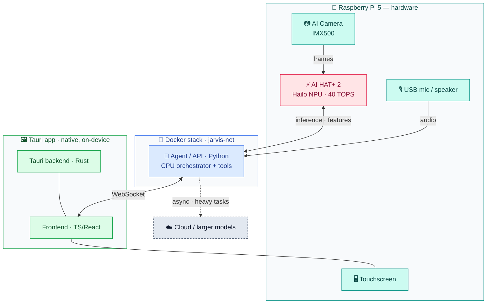

# Architecture

Work routes across three compute layers; the Dockerized agent and the native Tauri display
talk over one WebSocket.

## Compute layers
`agent/src/jarvis_agent/routing/` places each backend on a layer — **camera** (IMX500),
**NPU** (Hailo), **CPU** (Pi orchestrator), **remote** (cloud / larger model) — and picks
the first available one. Off-device the camera/NPU slots are empty, so work lands on CPU.
- **Policy** (explicit, no model): the caller's route wins; else `deep` or a prompt over
  ~4k chars → **heavy**; else **hot** (local 1–4B `llm`, NPU before CPU).
- **Heavy** runs on `heavy_llm` via `Router.offload()`, which returns an `asyncio.Task`
  at once; the reply re-enters later (Offloaded → Speaking), never on the hot path.
- **Fallback:** heavy unconfigured, failing or timed out (120 s) → the local `llm` answers
  and the reply is marked `degraded`.

## Role backends
The agent talks to models only through role interfaces (`agent/src/jarvis_agent/backends/`);
every role has a deterministic mock, the default in tests, CI and the devcontainer.

| Role | Interface | Dev backend | Pi backend |
|---|---|---|---|
| LLM | `chat`, `stream` | OpenAI-compatible HTTP → Ollama | Hailo-Ollama¹ |
| STT | `transcribe` | OpenAI-compatible HTTP → speaches (Whisper) | TBD (Hailo Whisper / CPU) |
| TTS | `synthesize` | OpenAI-compatible HTTP → speaches (Piper) | Piper (CPU) |
| Heavy LLM | `chat`, `stream` | none (→ LLM) or OpenAI-compatible HTTP → vLLM / cloud | same |
| Vision | `detect` | mock only | IMX500 / Hailo (#35, #60) |

¹ Speaks Ollama's API; its OpenAI `/v1` compatibility is unverified until tested on the Pi.
Selection is env-only: `JARVIS_<ROLE>_BACKEND=openai|mock` plus `_BASE_URL` / `_MODEL`
(see `.env.example`), so dev ↔ Pi is a config change, not a code change.

## Boundaries
- **Python** = agent/API + tools (Docker). **TS/React** = frontend. **Rust** = Tauri backend only.
- The display is a **native Tauri app** (not in Docker); it reaches the stack over **WebSocket**.

## WebSocket bridge
The TS client in the webview (`frontend/src/agent/`) connects to the agent's `/ws`; Rust
does not proxy it. Frames are envelope v0 `{v, type, id, payload}`. The agent's `hello`
carries its protocol: a mismatch shows **incompatible** and stops retrying until a manual
Retry. Ping every 15s (pong within 5s), else reconnect with jittered backoff (≤10s). The
Tauri CSP `connect-src` must list the agent URL (`VITE_AGENT_WS_URL`).

See [state-machine.md](state-machine.md) for the agent loop, [deploy.md](deploy.md) for delivery.

## State
Jarvis keeps its own state in one local SQLite file (`agent/src/jarvis_agent/store/`,
`JARVIS_STATE_DB`), so it works standalone ([ADR 0005](adr/0005-local-sqlite-state-store.md)).
- **Local (Jarvis-owned):** conversation memory, preferences/capability config and caches
  (key-value), queued notifications, and notes / todos / calendar by default.
- **Faelab-owned, never copied locally:** 3D-print queue, ideas, weather, and notes / todos /
  calendar when `JARVIS_<NOTES|TODO|CALENDAR>_PROVIDER=faelab`.
- Every domain is an async provider interface; snapshots (SQLite online backup, typically
  well under 10 MB) cover only the local file and back promote/rollback (#67). Additive
  migrations keep the file readable by the previous release.
