# Deployment

Dev in the devcontainer; CI gates; release-please cuts per-component releases; GitHub
Actions ships a compatibility-matched set to the Pi over SSH.

```mermaid
flowchart LR
  subgraph DEV["💻 Dev · devcontainer"]
    DC["docker-outside-of-docker<br/>compose · jarvis-net"]
  end
  subgraph GH["🐙 GitHub"]
    direction TB
    CI["✅ Actions · CI<br/>lint · test · build"]
    RP["🏷️ release-please<br/>agent-v* / app-v*"]
    REL["📦 Release + artifacts<br/>GHCR image · Tauri bundle"]
  end
  subgraph PI["🤖 Raspberry Pi 5 · on-device"]
    STACK["compose stack + native Tauri app"]
  end

  DC -->|push / PR| CI
  CI --> RP --> REL
  REL -->|SSH deploy · matched set| STACK
  REL -.->|release detected| SELF["🔁 self-deploy<br/>(human in loop)"] -.-> STACK

  classDef dev fill:#DBEAFE,stroke:#2563EB,color:#1E3A8A;
  classDef gh fill:#EDE9FE,stroke:#7C3AED,color:#4C1D95;
  classDef pi fill:#DCFCE7,stroke:#16A34A,color:#14532D;
  classDef future fill:#F1F5F9,stroke:#94A3B8,color:#334155,stroke-dasharray:5 3;
  class DC dev
  class CI,RP,REL gh
  class STACK pi
  class SELF future
  style DEV fill:#F8FAFC,stroke:#2563EB,color:#1E3A8A
  style GH fill:#F8FAFC,stroke:#7C3AED,color:#4C1D95
  style PI fill:#F8FAFC,stroke:#16A34A,color:#14532D
```

- The hardware inference path (Hailo · IMX500 · GPIO) is **Pi-only** — never in the devcontainer.
- **Deploy** = GitHub Actions → SSH to the Pi with a compatibility-matched agent+app set.
- **Stretch:** Jarvis detects a new release and self-deploys, with a human approving.
