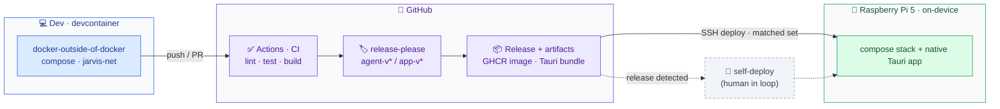

# Deployment

Dev in the devcontainer; CI gates; release-please cuts per-component releases; GitHub
Actions ships a compatibility-matched set to the Pi over SSH.

```mermaid
flowchart LR
  subgraph DEV["💻 Dev · devcontainer"]
    DC["docker-outside-of-docker<br/>compose · jarvis-net"]
  end
  subgraph GH["🐙 GitHub"]
    direction TB
    CI["✅ Actions · CI<br/>lint · test · build"]
    RP["🏷️ release-please<br/>agent-v* / app-v*"]
    REL["📦 Release + artifacts<br/>GHCR image · Tauri bundle"]
  end
  subgraph PI["🤖 Raspberry Pi 5 · on-device"]
    STACK["compose stack + native Tauri app"]
  end

  DC -->|push / PR| CI
  CI --> RP --> REL
  REL -->|SSH deploy · matched set| STACK
  REL -.->|release detected| SELF["🔁 self-deploy<br/>(human in loop)"] -.-> STACK

  classDef dev fill:#DBEAFE,stroke:#2563EB,color:#1E3A8A;
  classDef gh fill:#EDE9FE,stroke:#7C3AED,color:#4C1D95;
  classDef pi fill:#DCFCE7,stroke:#16A34A,color:#14532D;
  classDef future fill:#F1F5F9,stroke:#94A3B8,color:#334155,stroke-dasharray:5 3;
  class DC dev
  class CI,RP,REL gh
  class STACK pi
  class SELF future
  style DEV fill:#F8FAFC,stroke:#2563EB,color:#1E3A8A
  style GH fill:#F8FAFC,stroke:#7C3AED,color:#4C1D95
  style PI fill:#F8FAFC,stroke:#16A34A,color:#14532D
```

- The hardware inference path (Hailo · IMX500 · GPIO) is **Pi-only** — never in the devcontainer.
- **Deploy** = GitHub Actions → SSH to the Pi with a compatibility-matched agent+app set.
- **Stretch:** Jarvis detects a new release and self-deploys, with a human approving.

## Release artifacts and deploy
- **Artifacts** (`release-artifacts.yml`, on each published release): `agent-v*` pushes
  `ghcr.io/faering/jarvis-agent:<DOCKER_TAG>` (amd64 + arm64); `app-v*` attaches
  `Jarvis_<version>_{amd64,arm64}.deb`. Each release also gets a `manifest.json` (version,
  revision, protocol). Nothing builds unless the tagged commit's `ci-ok` passed.
- **Integration test** (`integration` job in `ci-ok`; `scripts/integration-test.sh`, add
  `IT_NETWORK=1` in the devcontainer): the app's real `AgentClient` against the agent
  container, plus each side against the other's latest release (agent: GHCR image, else
  built from its tag).
- **Deploy** (`deploy.yml`) runs after the artifacts, or by hand for one component + version.
  It rolls out only that component, and refuses a pair that fails
  [COMPATIBILITY.md](../COMPATIBILITY.md). The agent must turn healthy and report the
  expected version; the app's installed package version must match.
- **Models:** before replacing the agent, the deploy starts the Pi's `ollama` service and
  pulls the models the new agent is assigned (`models pull --assigned`, [models](models.md)).
  If that fails, the deploy stops and the running agent is left as it was.
- **Rollback** is automatic on a failed rollout (previous image or `.deb`). To go back on
  purpose, run `deploy` by hand with the older version. A failed *first* agent deploy
  removes the container instead. The app `.deb` is staged in `~/jarvis/incoming/` and
  becomes `~/jarvis/app/current.deb` only once installed (the old one → `previous.deb`).
- **Enable it:** follow the [Pi first-time setup](pi-setup.md) (Tailscale,
  deploy key, the `pi` environment and its secrets, then `PI_DEPLOY_ENABLED=true`).
- **Pi prerequisites:** Pi OS Trixie or newer (64-bit; the `.deb` is built on Ubuntu 24.04),
  Docker with Compose v2, reachable over SSH from GitHub runners, and a public GHCR package
  (or `sudo docker login ghcr.io`: root pulls the image).

### Privilege model ([ADR 0009](adr/0009-least-privilege-deploy.md))
- The SSH key logs in as `deploy`, which is **not** in the `docker` group (that is
  root-equivalent). Its only root access is two root-owned scripts, via sudoers:
  `/usr/local/sbin/jarvis-deploy-agent` and `/usr/local/sbin/jarvis-install-app`.
- `jarvis-deploy-agent deploy <tag> <version> <protocol>` accepts only a `DOCKER_TAG` of
  `ghcr.io/faering/jarvis-agent` and runs the root-owned `/opt/jarvis/docker-compose.yml`
  (from `deploy/pi/`); deploys never upload a compose file. `… state` prints the agent state.
- Root-owned on the Pi: runtime config `/opt/jarvis/agent.env` (600), agent state
  `/var/lib/jarvis/agent.env`. The app's state and `.deb`s stay in `~deploy/jarvis/`.
- The root scripts and compose file change only when an admin re-runs the Pi setup.
- Deploys log to `/var/log/jarvis/jarvis-deploy-<date>.log` (`jarvis-logs --component
  deploy`) and stderr. The app's rollback decisions show only in the job output: `deploy` is
  not in `jarvis-log`, so it can't write or delete logs.
