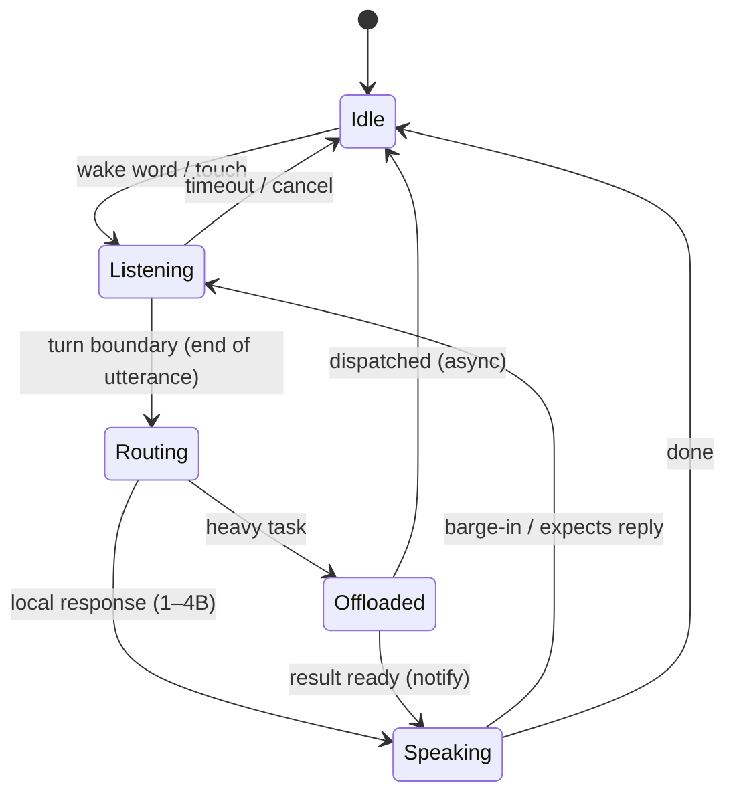

# Agent state machine

The brain: the always-on voice loop. Speech output never blocks — it runs on a
producer/consumer queue and yields at turn boundaries, so a barge-in wins instantly.

## States
- **Idle** — always-on wake detection.
- **Listening** — capture the utterance until the turn boundary.
- **Routing** — pick the compute layer: NPU-local vs async cloud/larger model.
- **Speaking** — non-blocking TTS; interruptible.
- **Offloaded** — heavy task runs async; the loop stays responsive; its result re-enters at Speaking.

## Invariants
- Speaking never blocks the loop (producer/consumer queue).
- A barge-in during Speaking jumps straight back to Listening.

## Speech output
`jarvis_agent.speech.SpeechQueue` implements Speaking.
- **Producers** call sync `begin_turn`/`feed`/`end_turn`/`say`; they never await TTS.
- **Segmentation:** text is cut at sentence ends (and clauses in long sentences), so TTS
  starts before the reply is complete. The next chunk is synthesized while one plays.
- **Barge-in:** `interrupt()` stops the sink, cancels in-flight TTS and drops all queued
  turns; chunks carry a turn id, so stale audio never plays.
- **Backpressure:** pending text is bounded; when full, new chunks are dropped and logged
  rather than blocking the loop. Audio output is the `AudioSink` seam (Pi speaker later).
